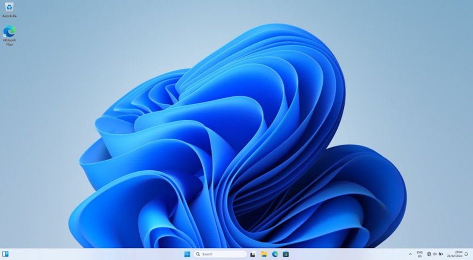
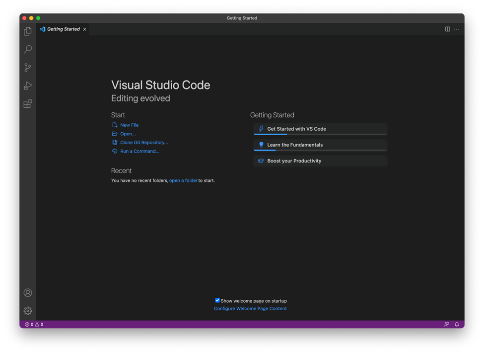

[](https://classroom.github.com/a/vbnbTt5m)
[](https://classroom.github.com/online_ide?assignment_repo_id=15270101&assignment_repo_type=AssignmentRepo)
# Dev_Setup
Setup Development Environment

#Assignment: Setting Up Your Developer Environment

#Objective:
This assignment aims to familiarize you with the tools and configurations necessary to set up an efficient developer environment for software engineering projects. Completing this assignment will give you the skills required to set up a robust and productive workspace conducive to coding, debugging, version control, and collaboration.

#Tasks:

1. Select Your Operating System (OS):
   Choose an operating system that best suits your preferences and project requirements. Download and Install Windows 11. https://www.microsoft.com/software-download/windows11

2. Install a Text Editor or Integrated Development Environment (IDE):
   Select and install a text editor or IDE suitable for your programming languages and workflow. Download and Install Visual Studio Code. https://code.visualstudio.com/Download
3. Set Up Version Control System:
   Install Git and configure it on your local machine. Create a GitHub account for hosting your repositories. Initialize a Git repository for your project and make your first commit. https://github.com

4. Install Necessary Programming Languages and Runtimes:
  Instal Python from http://wwww.python.org programming language required for your project and install their respective compilers, interpreters, or runtimes. Ensure you have the necessary tools to build and execute your code.

5. Install Package Managers:
   If applicable, install package managers like pip (Python).

6. Configure a Database (MySQL):
   Download and install MySQL database. https://dev.mysql.com/downloads/windows/installer/5.7.html

7. Set Up Development Environments and Virtualization (Optional):
   Consider using virtualization tools like Docker or virtual machines to isolate project dependencies and ensure consistent environments across different machines.

8. Explore Extensions and Plugins:
   Explore available extensions, plugins, and add-ons for your chosen text editor or IDE to enhance functionality, such as syntax highlighting, linting, code formatting, and version control integration.

9. Document Your Setup:
    Create a comprehensive document outlining the steps you've taken to set up your developer environment. Include any configurations, customizations, or troubleshooting steps encountered during the process. 

#Deliverables:
- Document detailing the setup process with step-by-step instructions and screenshots where necessary.
- A GitHub repository containing a sample project initialized with Git and any necessary configuration files (e.g., .gitignore).
- A reflection on the challenges faced during setup and strategies employed to overcome them.

#Submission:
Submit your document and GitHub repository link through the designated platform or email to the instructor by the specified deadline.

Answers to Assignment One – Setting Up Development Environment
This document outlines the steps taken to set up a robust and productive developer environment conducive to coding, debugging, version control, and collaboration.
1. Selected Operating System (OS)
Task: Downloaded and installed Windows 11.
Steps:
1. Visited the [Windows 11 download page](https://www.microsoft.com/software-download/windows11).
2. Clicked on "Download Now" and followed the on-screen instructions to download the installation media.
3. Created a bootable USB using the Windows 11 installation media tool.
4. Inserted the installation media into your computer and reboot.
5. Followed the prompts to install Windows 11.
Screenshot
 

2. Installed a Text Editor or Integrated Development Environment (IDE)
Task: Downloaded and installed Visual Studio Code (VS Code).
Steps:
1. Visited the [Visual Studio Code download page](https://code.visualstudio.com/Download).
2. Selected the installer for Windows and download it.
3. Run the installer and follow the on-screen instructions to complete the installation.
Screenshot

 
3. Setting Up Version Control System
Task: Installed Git, configure it, and create a GitHub account.
Steps:
1. Visited the [Git download page](https://git-scm.com/download/win) and downloaded the Git installer for Windows.
2. Run the installer and follow the on-screen instructions.
3. Opened Git Bash and configure Git with your user information:
   git config --global user.name "Mohaa72"
   git config --global user email Ibrahim.tuke1@students.jkuat.ac.ke

4. Visited [GitHub](https://github.com) and sign up for an account.
5. Created a new repository on GitHub.
Initialized a Git Repository
1. Navigated to my project directory:
   ```bash
   cd path/to/my/project
   ```
2. Initialized a Git repository:
   ```bash
   git init
   ```
3. Added files and make the first commit:
   ```bash
   git add .
   git commit -m "Initial commit"
   ```
4. Link the local repository to the GitHub repository:
   ```bash
   git remote add origin https://github.com/myusername/my-repo.git
   git push -u origin master

4. Installed Necessary Programming Languages and Runtimes
Task: Installed Python.
Steps:
1. Visited the [Python download page](https://www.python.org/downloads/).
2. Downloaded the latest version for Windows.
3. Run the installer and ensure you check the option to add Python to your PATH.
4. Verified the installation:
   ```bash
   python –version

5. Installed Package Managers
Task: Installed pip.
Steps:
1. pip is installed by default with Python. Verify pip installation:
   ```bash
   pip --version
   ```
6. Configured a Database (MySQL)
Task: Downloaded and install MySQL.
Steps:
1. Visited the [MySQL download page](https://dev.mysql.com/downloads/windows/installer/5.7.html).
2. Downloaded the MySQL Installer for Windows.
3. Run the installer and followed the on-screen instructions to install MySQL.

8. Explored Extensions and Plugins
Task: Enhanced functionality of VS Code.
Steps:
1. Opened VS Code.
2. Gone to the Extensions view by clicking the Extensions icon in the Sidebar or pressing `Ctrl+Shift+X`.
3. Search for and install extensions like:
   - Python

GitHub Repository Link
[Sample Project Repository]( https://github.com/mohaa72/AfternoonSEPLPSeasion)


#Evaluation Criteria:**
- Completeness and accuracy of setup documentation.
- Effectiveness of version control implementation.
- Appropriateness of tools selected for the project requirements.
- Clarity of reflection on challenges and solutions encountered.
- Adherence to submission guidelines and deadlines.

Note: Feel free to reach out for clarification or assistance with any aspect of the assignment.
